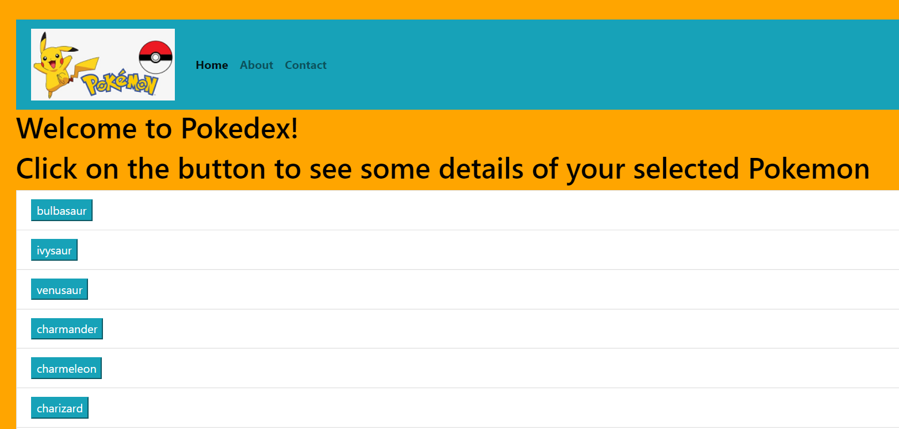

**Pokedex App**

**Project Objectives**
To build a small web application (Pokedex) that is meant to load data from an external Application Programming Interface (API)
that enables user to view the details of the individual Pokemon (name, image and height) upon click.

**Built With**
* HTML
* CSS
* Javascript
* JQuery
* Atom Editor

**Platforms**
* Chrome
* Firefox
* Safari
* Edge
* Internet Explorer 11

**API used
Pokemon API

**Author:**
:camel: Rina Ong-Oehme

**Acknowledgements:**
Matthew Wacha and Treasure Kabareebe
